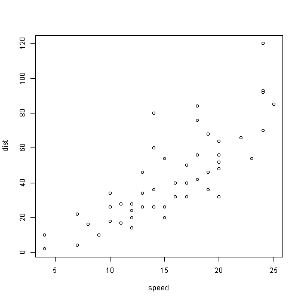

R presentation Demo
========================================================
author: Murali
date: 14/May/2015
# 
This is *italic*    
This is **bold**
# Header 1
## Header 2
### Header 3
Mrkdoen tips...
===============
* Item 1
* Item 2
  + Item 2a
  + Item 2b
  
[R Capsules] (http://rcapsules.com)   
> This is block quote   
> Title ends here


First Slide
========================================================

For more details on authoring R presentations click the
**Help** button on the toolbar.

- Bullet 1
- Bullet 2
- Bullet 3   
--- HR   
**** HR   

superscript^2^    


~~strikethrough~~    
ASCII characters are transformed into typographic HTML entities:
Straight quotes ( " and ' ) into “curly” quotes
Dashes (“--” and “---”) into en- and em-dash entities
Three consecutive dots (“...”) into an ellipsis entity

Two-Column Slide
====================================
First column
Hi There
***
Second column
HI here  
Yet another one


Slide With Code
========================================================


```r
summary(cars)
```

```
     speed           dist       
 Min.   : 4.0   Min.   :  2.00  
 1st Qu.:12.0   1st Qu.: 26.00  
 Median :15.0   Median : 36.00  
 Mean   :15.4   Mean   : 42.98  
 3rd Qu.:19.0   3rd Qu.: 56.00  
 Max.   :25.0   Max.   :120.00  
```

```r
length(cars)
```

```
[1] 2
```

Slide With Plot
========================================================

 
